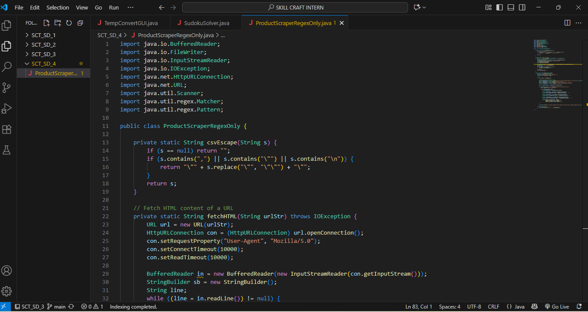
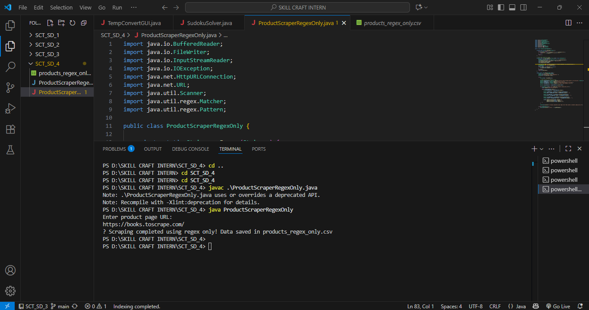
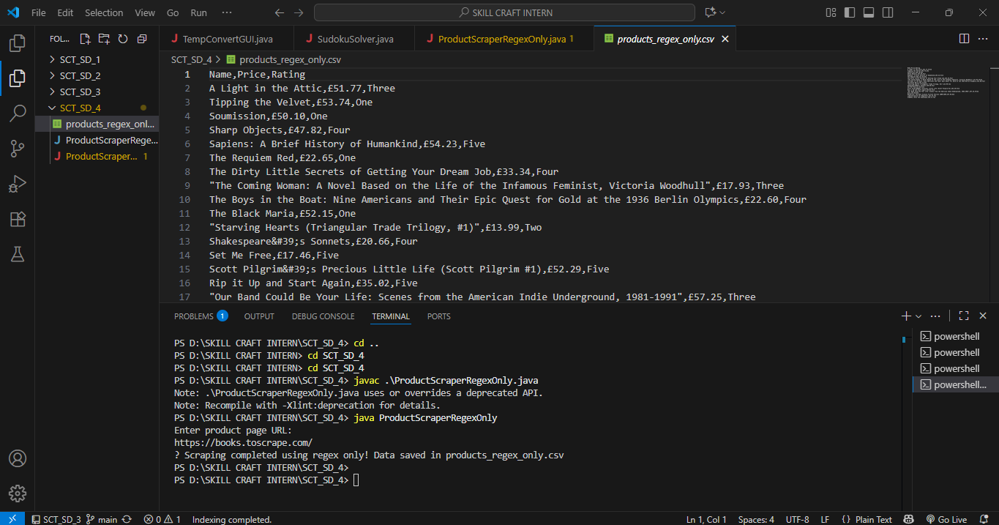

🛍️ ProductScraperRegexOnly – Console Product Scraper

This project is part of SkillCraft Technology Software Development Internship (Task 4).
It’s a Java console program that scrapes product information from websites like Books to Scrape and saves it in a CSV file.

Unlike many scrapers, this one is 100% regex-based — no external libraries like JSoup are required.

📝 Overview

- Fetches Product Name, Price, and Rating from the webpage.

- Formats data cleanly and stores it in a CSV file for easy analysis.

- Handles special characters in product names (commas, quotes, newlines).

- Works entirely in the console — just run, enter URL, and get results.

🌟 Key Features

💻 Console Application – No GUI required.

📊 CSV Output – File: products_regex_only.csv.

🏷️ Extracts Important Data – Name, Price, Rating.

⚡ Lightweight & Simple – Pure Java using regex and HTTP requests.

🙌 Easy to Use – Enter a URL and the program does everything.

📂 Project Structure

SCT_SD_4/
│

├─ ProductScraperRegexOnly.java      # Source code

├─ ProductScraperRegexOnly.class     # Compiled Java class

├─ products_regex_only.csv           # Generated CSV file

├─ README.md                         # Project documentation

└─ Results/                          # Screenshots or other images

🚀 How to Run

1️⃣ Compile

javac ProductScraperRegexOnly.java

2️⃣ Run

java ProductScraperRegexOnly

3️⃣ Input

Enter a product page URL when prompted, for example:

https://books.toscrape.com/

4️⃣ Output

CSV file is generated in the same folder:

products_regex_only.csv

📄 Sample CSV Content

Name	Price	Rating

A Light in the Attic	£51.77	Three

Tipping the Velvet	£53.74	One

Soumission	£50.10	Five

Sharp Objects	£47.82	Two

Sapiens: A Brief History of Humankind	£54.23	Four

📸 Result Screenshots

ConsoleCode:

ConsoleOutput:

ProductsCSVOutput:

🌱 Learning & Takeaways

✅ Learned how to scrape HTML using regex without external libraries.

✅ Practiced pattern matching with Pattern and Matcher in Java.

✅ Learned how to handle CSV formatting, including special characters.

✅ Built a console-driven Java application that is user-friendly.

✅ Gained experience with Git & GitHub for version control.

